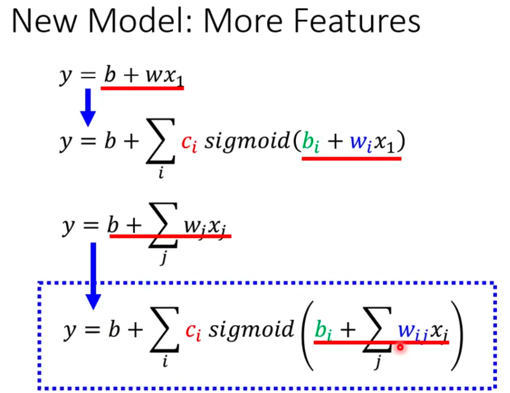
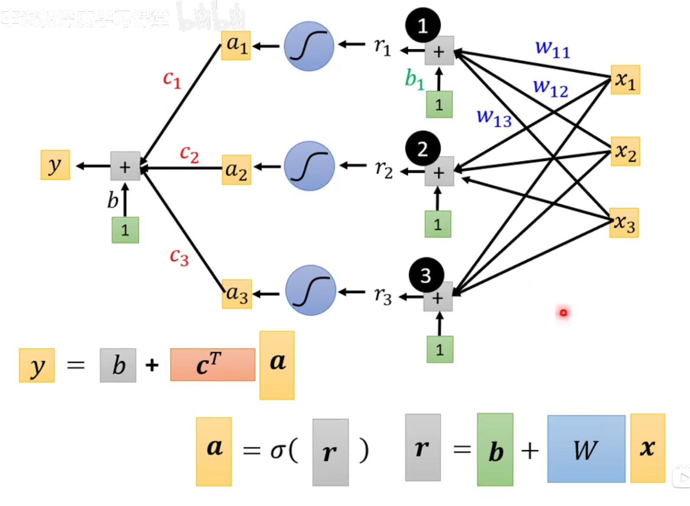
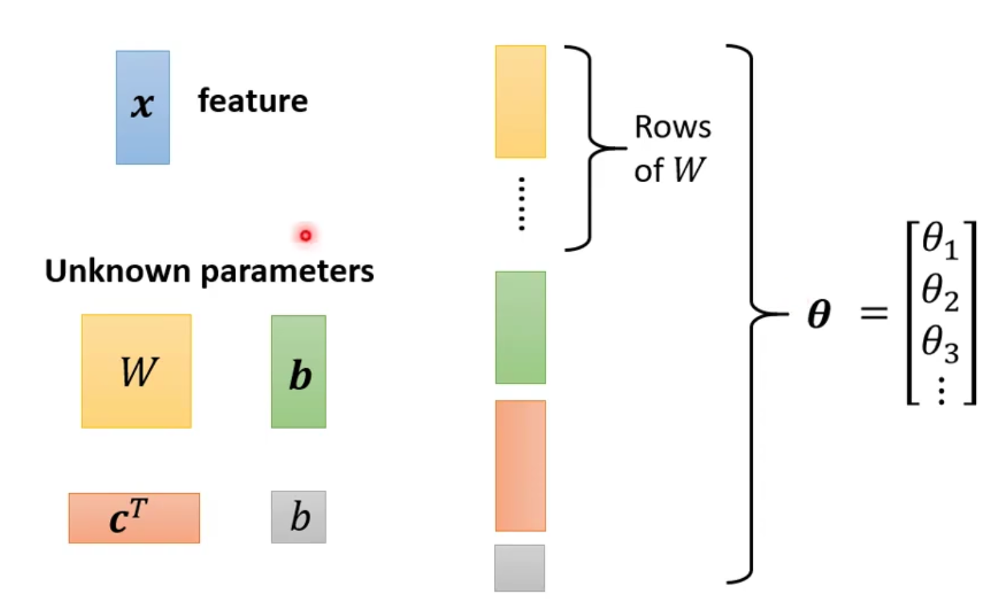
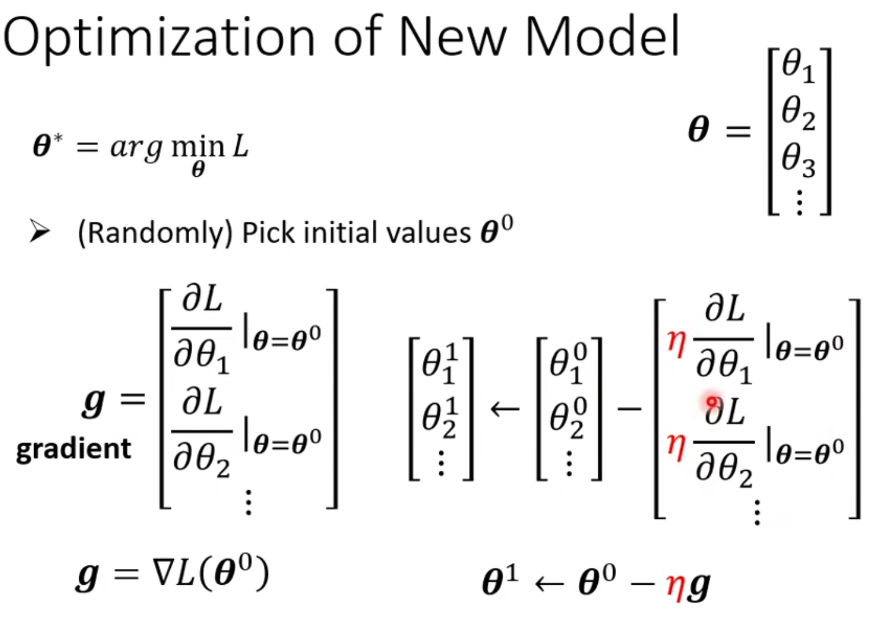

+ 任务种类
  + classification
  + regression
  + structured learning

1. function with unknown parameters (model)
   + based on domain knowledge
2. define loss from training data
   + $L=1/N\sum e_n$
   + MAE
   + MSE
   + crossentropy
3. optimization
   1. $w*,b*=arg min_{w,b}L$
   2. Gradient Descent
4. sgimoid function
    
    
    ---
    ### $y=b+c^T\sigma(b+Wx)$
    ---
    
5. optimization of New model
   \
6. batch size
   1. 只算一个batch的loss更新参数
   2. 看过每个batch叫一个epoch
7. Sigmoid & ReLU
8. 多层神经网络
9. 过拟合