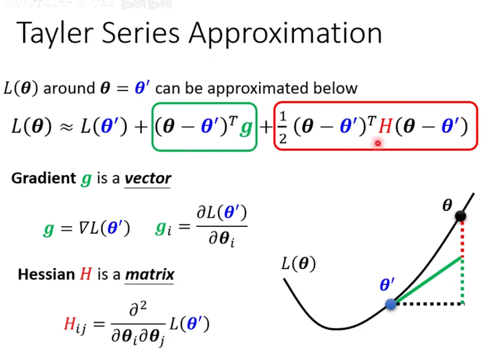
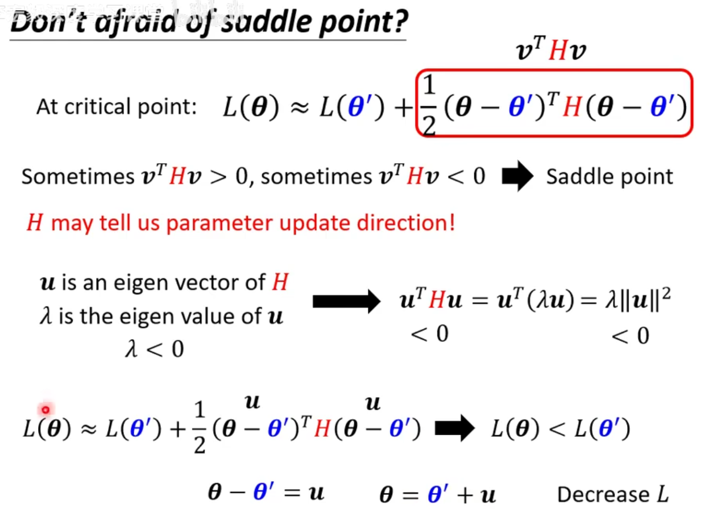
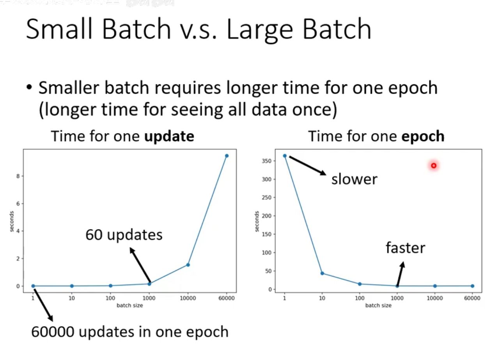
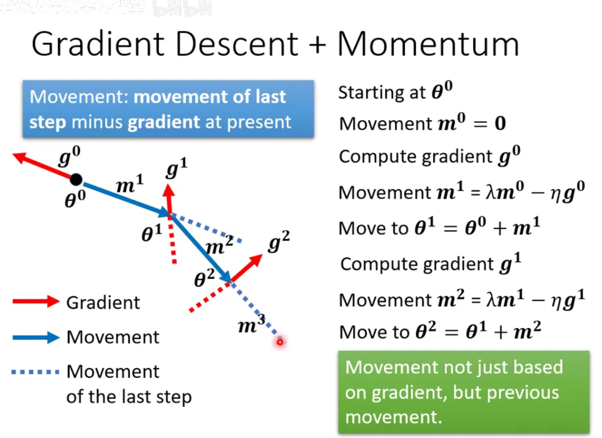
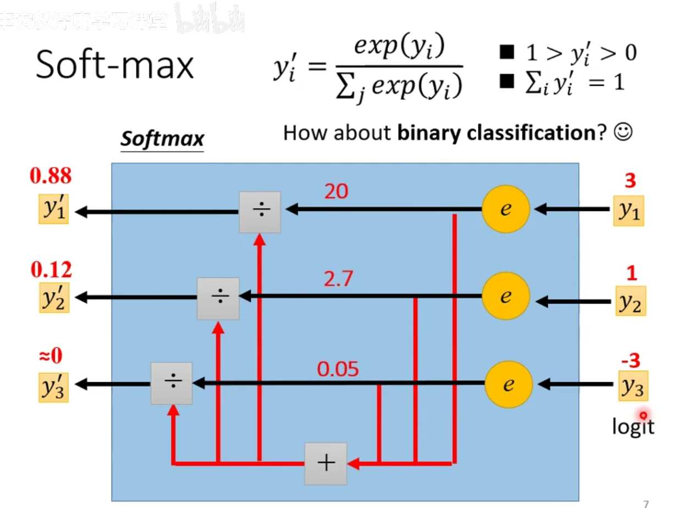
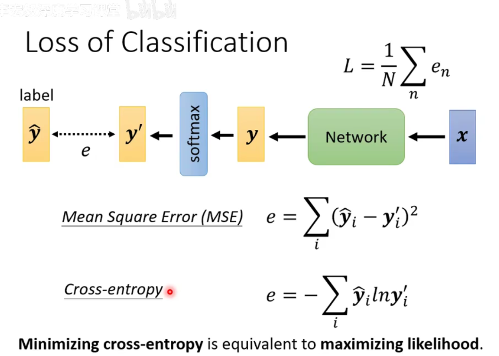

# framework of ML
+ function with unknown
+ define loss from training data
+ optimization

### how to fix overfitting
- data augmentation (proper)
- 限制 model
  - less paras
  - sharing parameters
  - Fully-connected:flexible
  - CNN:limited
  - less features
  - early stopping
  - regularization
  - dropout

### n-fold cross validation

## better optimization
gradient = 0， 不再更新
+ local minima ($v^THv>0$)
  + H是正定矩阵，所有特征值大于零
+ saddle point ($v^THv不确定$)
### 泰勒展开（多元）

通过负特征值的特征向量优化（impractical）

基本都是saddle point，还有优化空间

## optimization with batch

**1 epoch = see all the batches once => Shuffle after each epoch**

batchsize越大，越节省时间，batchsize过大也不好

## momentum
**movement of last step minux gradient at present**

## adaptive lr
training stuck $\ne$ small gradient

$\eta\rightarrow \frac\eta{\sigma^t_i},\sigma^t_i=\sqrt{\frac1{t+1} \sum_{i=0}^t(g^t_i)^2}$

> RMSProp方法 调整不同g的权重
> $\sigma_i^t=\sqrt{\alpha(\sigma_i^{t-1})^2+(1-\alpha)(g^t_i)^2}$

**Adam:RMSProp + Momentum**

learning rate decay:lr越来愈小

warmup:lr先变大再变小

## classification

class as one-hot vector

softmax

交叉熵损失
